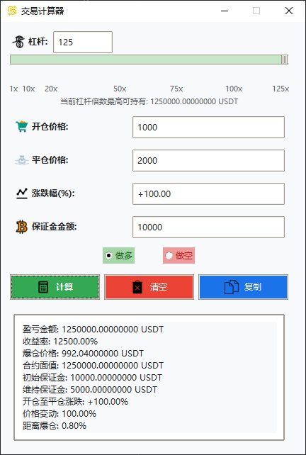

# 交易计算器

一个基于 Python/Tkinter 开发的交易计算器，用于快速计算加密货币杠杆交易的盈亏情况。

## 功能特点

- 支持最高125倍杠杆交易计算
- 自动计算盈亏金额和收益率
- 实时计算爆仓价格和距离爆仓百分比
- 支持做多/做空方向选择
- 支持涨跌幅和目标价格双向计算
- 美观的图形用户界面
- 一键复制计算结果
- 实时显示最大可持仓金额

## 界面预览



## 安装要求

- Python 3.8+
- tkinter (Python 标准库)
- Pillow 11.0+

## 安装步骤

1. 克隆仓库
```bash
git clone https://github.com/openai1998/TransactionCalculator.git
cd TransactionCalculator
```

2. 安装依赖
```bash
pip install -r requirements.txt
```

3. 运行程序
```bash
python app.py
```
## Windows预打包文件

为方便Windows用户使用,提供了打包好的exe可执行文件:

1. 下载地址: [交易计算器v1.0.exe](https://github.com/openai1998/TransactionCalculator/releases/tag/Release)

2. 下载完成后直接双击运行即可,无需安装Python环境

注意:
- 首次运行可能会被杀毒软件拦截,请允许运行
- 如遇到问题,建议使用上述源码方式安装运行

## 使用说明

1. **杠杆设置**
   - 通过滑动条或直接输入设置杠杆倍数（1-125倍）
   - 实时显示当前杠杆下的最大可持仓金额

2. **交易参数输入**
   - 开仓价格：输入开仓时的价格
   - 平仓价格：输入目标平仓价格
   - 涨跌幅：可直接输入目标涨跌幅，自动计算平仓价格
   - 保证金金额：输入投入的保证金金额

3. **交易方向选择**
   - 做多：预期价格上涨时选择
   - 做空：预期价格下跌时选择

4. **计算结果显示**
   - 盈亏金额（USDT）
   - 收益率（%）
   - 爆仓价格
   - 合约面值
   - 初始/维持保证金
   - 价格变动百分比
   - 距离爆仓百分比

5. **其他功能**
   - 一键清空：快速清除所有输入
   - 一键复制：复制所有计算结果

## 项目结构

```shell
交易计算器/
├── app.py          # 主程序
├── requirements.txt # 依赖列表
├── README.md       # 项目说明
└── img/            # 图标资源
    ├── 1.png          # 程序图标
    ├── delete.png     # 清空按钮图标
    ├── calculator.png # 计算按钮图标
    ├── copy.png      # 复制按钮图标
    ├── buy.png       # 做多图标
    ├── sell.png      # 做空图标
    ├── increase.png  # 涨跌幅图标
    ├── btc.png       # 币种图标
    └── leverage.png  # 杠杆图标
```

## 开发计划

- [ ] 添加更多币种支持
- [ ] 添加止盈止损计算
- [ ] 支持深色模式
- [ ] 添加历史记录功能
- [ ] 支持配置保存

## 常见问题

1. **为什么我的图标无法显示？**
   - 确保所有图标文件都在 img 目录下
   - 检查图标文件名是否正确
   - 确保图标文件格式为 PNG

2. **如何修改默认杠杆倍数？**
   ```python
   # 在 app.py 中修改 LEVERAGE_VALUES 列表
   LEVERAGE_VALUES = [1, 2, 5, 10, 20, 50, 100, 125]
   ```


## 许可证

本项目采用 MIT 许可证，这意味着你可以自由地使用、修改和分发本项目，但需要保留原始许可证和版权声明。

详细信息请查看 [LICENSE](LICENSE) 文件。

## 联系方式

如有问题或建议，欢迎提交 [Issue](https://github.com/openai1998/TransactionCalculator/issues) 或通过以下方式联系：
## 致谢

- 感谢所有贡献者的支持
- 图标来源：[Icons8](https://icons8.com/)


